# Treasury

<a href="https://modrinth.com/mod/treasury"></a></img>

A simple economy & points API for Minecraft mods.  
Inspired by the Bukkit Vault plugin.  

Treasury **is not an economy implementation**.  
Instead, like Vault, other mods provide implementations, and Treasury acts as a bridge layer between them.

## Overview

Treasury provides a unified way for mods to:

- Access server economy
- Access points / premium currency
- Avoid hard dependencies on specific economy implementations

## Architecture

Treasury is designed as a **server-side abstraction layer**.

- Clients never modify economy data
- All logic is executed on the server
- Treasury providers are part of server logic, not network layers

See below:


## Roadmap

1. Provide a stable first implementation
2. Improve API and internal design
3. Add Vault compatibility for hybrid servers

## Features

* Multi-economy provider support
* Single points provider support
* Automatic primary economy selection
* Clean API for mod developers

## How It Works

Treasury defines two main provider types:

* `EconomyProvider` — economy currency
* `PointsProvider` — points / premium currency

Implementation mods register providers, and other mods consume them through the API.

## Registry

### Economy

* Managed by `EconomyServiceRegistry`
* Supports multiple providers
* One provider is selected as primary

Regsiter:
```java
Treasury.economy().register(new ExampleEconomyProvider());
```

Selection rules:

1. Use `primaryEconomy` from config if specified
2. Otherwise, use the first registered provider

### Points

* Managed by `PointsServiceRegistry`
* Only one provider allowed

Register:
```java
Treasury.points().register(new ExamplePointsProvider());
```

Registering a second provider will throw an exception.

### Fabric Entrypoints

Treasury supports automatic provider loading via Fabric entrypoints:

* `treasury-economy`
* `treasury-points`

Example:

```json
{
  "entrypoints": {
    "treasury-economy": [
      "com.example.mod.ExampleEconomyProvider"
    ],
    "treasury-points": [
      "com.example.mod.ExamplePointsProvider"
    ]
  }
}
```

## Usage

### Economy

```java
if (Treasury.economy().hasPrimary()) {
    EconomyProvider economy = Treasury.economy().getPrimary();
    double balance = economy.getBalance(playerUuid);
}
```

### Points

```java
if (Treasury.points().isRegistered()) {
    PointsProvider points = Treasury.points().get();
    int balance = points.getBalance(playerUuid);
}
```

## Commands

* `/treasury info`  
   Required Permission Level: `2`
* `/treasury balance [player]`  
   Required Permission Level: `1`

## Requirements

* Fabric: Minecraft `1.20.1+`
* NeoForge: Minecraft `1.20.4+`
* Java: `17+`

## Build

```bash
./gradlew build
```

## Dependency

```kotlin
dependencies {
    compileOnly("io.github.lijinhong11:treasury:VERSION")
}
```

## Notes

* Treasury is API-only and does not store or manage data itself!
* All economy logic is handled by provider implementations
* Client-side interaction is limited to display and request forwarding